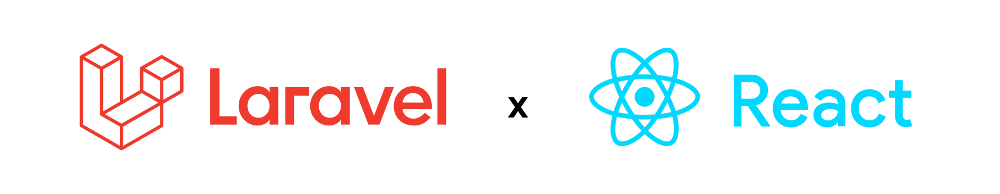

  
Migration Front-end to React JS comming soon after next lifecycle prod

## About RTApp
RTApp adalah aplikasi web untuk kegiatan rukuntetangga khususnya RT02 yang dimana seluruh kegiatan akan direncanakan, diumumkan, dan didokumentasikan didalam website ini, website ini mendukung fitur upload, embed, read pdf dan import / export csv to mysql.

## Application Technology Base
Laravel is a web application framework with expressive, elegant syntax. We believe development must be an enjoyable and creative experience to be truly fulfilling. Laravel takes the pain out of development by easing common tasks used in many web projects, such as:

- [Simple, fast routing engine](https://laravel.com/docs/routing).
- [Powerful dependency injection container](https://laravel.com/docs/container).
- Multiple back-ends for [session](https://laravel.com/docs/session) and [cache](https://laravel.com/docs/cache) storage.
- Expressive, intuitive [database ORM](https://laravel.com/docs/eloquent).
- Database agnostic [schema migrations](https://laravel.com/docs/migrations).
- [Robust background job processing](https://laravel.com/docs/queues).
- [Real-time event broadcasting](https://laravel.com/docs/broadcasting).

Laravel is accessible, powerful, and provides tools required for large, robust applications.

### Supported Library

- **[tailwindcss](https://tailwindcss.com/)**
- **[spatie](https://spatie.be/docs/laravel-permission/v6/installation-laravel)**
- **[Trix-Editor](https://github.com/basecamp/trix)**
- **[filepond](https://pqina.nl/filepond/#multi-file-code)**
- **[league\csv](https://csv.thephpleague.com/)**
- **[eloquent-sluggable](https://github.com/cviebrock/eloquent-sluggable)**

## Laravel Sponsors

We would like to extend our thanks to the following sponsors for funding Laravel development. If you are interested in becoming a sponsor, please visit the [Laravel Partners program](https://partners.laravel.com).

## Contributing

Thank you for considering contributing to the Laravel framework! The contribution guide can be found in the [Laravel documentation](https://laravel.com/docs/contributions).

## Code of Conduct

In order to ensure that the Laravel community is welcoming to all, please review and abide by the [Code of Conduct](https://laravel.com/docs/contributions#code-of-conduct).

## Security Vulnerabilities

If you discover a security vulnerability within Laravel, please send an e-mail to Taylor Otwell via [taylor@laravel.com](mailto:taylor@laravel.com). All security vulnerabilities will be promptly addressed.

## License

The Laravel framework is open-sourced software licensed under the [MIT license](https://opensource.org/licenses/MIT).
